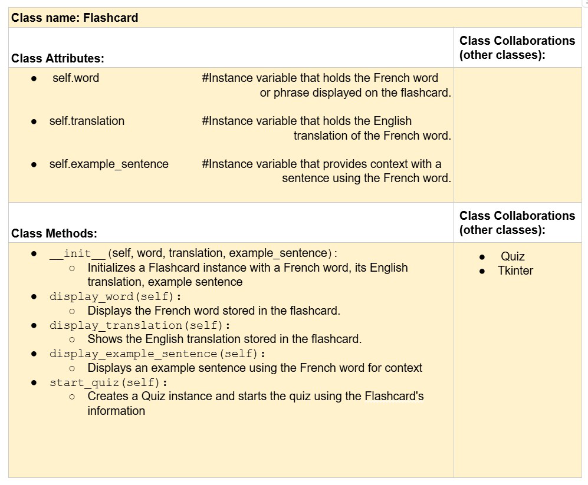
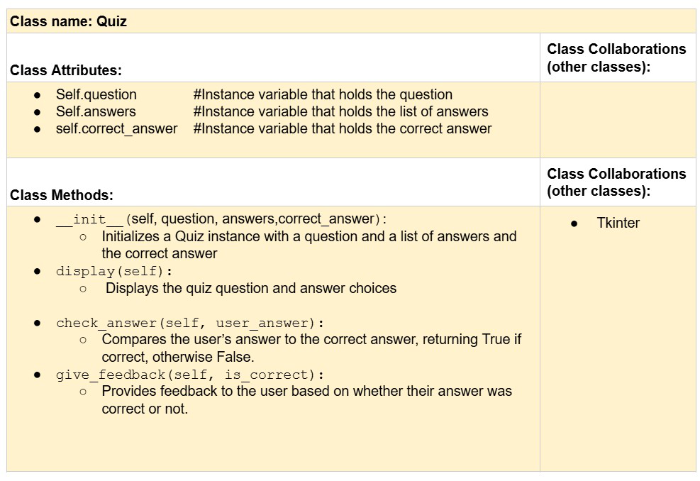

# CSC226 Final Project

## Instructions

**Author(s)**: Arohasina Ravoahanginiaina

**Google Doc Link**: https://docs.google.com/document/d/1jGpdXDdU7qafmN9_lEAigKttqIAKwALNgQ69IkVdbLk/edit?tab=t.0

**repo link**: https://github.com/Berea-College-CSC-226/p01-final-project-arohasina

---

## References

- tkinter label and font tutorial : https://www.geeksforgeeks.org/python-tkinter-label/
- font color list : https://cs111.wellesley.edu/archive/cs111_fall14/public_html/labs/lab12/tkintercolor.html

- chat GPT for: encoding='utf-8' which allows the letter like "é" and "è" to display properly. I asked: how to get the
letters "é" and "è" to display properly

- chat GPT for the method:
for widget in self.screen.winfo_children():
        widget.destroy()
I asked: how to remove the widgets when the event change

    winfo_children() is a method that returns a list of all the child widgets of a particular widget
    and then widget.destroy() removes all widget from the screen when it transitions to a new event

- how to include a background in tkinter:
https://stackoverflow.com/questions/10158552/how-to-use-an-image-for-the-background-in-tkinter

- chat GPT for self.answer_var = tk.StringVar(), which is a Variable to hold selected answer and let me use it in the 
to keep track of the user choice on the Quiz. I asked: how can i keep track of the user's answer

- chat GPT for self.screen.resizable(False, False) which Disable window resizing. I asked: how do I not allow user to expand the screen

---

## Milestone 1: Setup, Planning, Design

**Title**: ` Level Up Your French`

**Purpose**: `Flashcards project with an interactive tool for users to study French vocabulary, phrases, and grammar
 using flashcards and quizzes.`

**Source Assignment(s)**: `HW05: Funky Functions, Fun Exams`

**CRC Card(s)**:




**Branches**: 

```
    Branch name: Arohasina
```
---

## Milestone 2: Code Setup and Issue Queue

```
So far, I feel like I have a pretty good idea of what I’m supposed to do, mostly because I spent time planning and 
breaking tasks into smaller steps. That really helped me get organized and gave me a clear direction.

But honestly, I’m still feeling a bit anxious. Even though I know what needs to be done, I’m not always sure how to 
turn those tasks into actual code.

What worries me the most is getting stuck during implementation and not knowing how to fix it. 
At the same time, I’ve been surprised by how much the planning has helped me feel less overwhelmed overall.
```

---

## Milestone 3: Virtual Check-In

**Completion Percentage**: `70%`

**Confidence**: 

```
I feel relatively confident about completing the project. I had to remove some features like audio because I was 
unsure how to implement them. However, I have kept them in my issue queue for future enhancement. 
But I have managed to implement the key components of the project, such as the flashcards display,
 and now i am working on the quiz functionality, and scoring system, which I believe will meet the core requirements.

To increase the likelihood of success, I plan to keep breaking down the remaining tasks into smaller, 
manageable steps. I'll prioritize completing the quiz and final score display, 
as these are the most crucial aspects of the project. Additionally, I'll continue testing as I progress, 
identifying and resolving bugs early. 
If I encounter any issues, I will seek help from online resources, TAs or the professor. 

```

---

## Milestone 4: Final Code, Presentation, Demo

### User Instructions
```
The homepage will display a "Start Learning" button and a "Take the Quiz" button. If you select the "Start Learning" 
option, you'll be taken to the flashcard section where you can view individual English vocabulary words, 
their French translations, and how to use the French vocabulary in a sentence. You can continue through the list of 
flashcards until you're ready to start the quiz. When you are done learning all the flashcards, a quiz page will show 
where you will be ask to start the quiz or return to the Homepage and keep learning. Clicking the "Take the Quiz" button
will take you to the quiz section, where you'll be presented with multiple-choice questions. You can start the start 
the quiz anytime by clicking the "Take the Quiz" button. Each question will ask how a word is translated into French, 
with a set of possible answers. You'll select an answer using the radio buttons and submit your choice by clicking 
the "Submit" button. After answering, you'll receive immediate feedback, telling you whether your answer is correct 
or incorrect. The quiz will continue with more questions until all questions have been answered. 
At the end of the quiz, your final score will be displayed, and you'll have the option to retake the quiz 
or return to the homepage.
```

### Reflection

```
I decided to do this project because I am the TA for french 101 class and French is also one of my native language so 
I thought it would be cool to create an app that could help the students practice their french vocabularies. 
It allowed me to make something practical that could benefit others. I also saw it as an opportunity to challenge myself 
by building something complex and challenging that I could learn from.

The final project reflects my initial vision, but it wasn’t a straightforward. I initially outlined features 
like flashcards and quizzes, and while they made it to the final version, the process required constant adjustments. 
For example, I underestimated how complex it would be to generate the quiz options. 
And designing the graphical interface with Tkinter was also harder than I anticipated, particularly when trying 
to create visually appealing layouts, manage screen transitions, and also placing the widgets on the screen.
But I have learned a lot from it since it was my first time ever designing a GUI app. 
I had to rethink parts of my design such as the audio feature which i tried to do but i couldn't,
and also to test new approaches I hadn't planned for initially, such as adding background images and 
changing button placements to enhance user experience. I also chose to only include few words for now because it would 
be easier to manage and to test but I plan to keep adding words in the future and organazing them into chapters. 

I learned that it actually takes a lot of work to create something that might appear basic like adding a quiz feature or 
adding buttons and linking them to a command, or switching between flashcard and keeping track of everything like 
the index, the score, etc. But overall, I have learned a lot. It was a chance to apply what we have learned in class 
into a real-world project and I could better understand the uses of GUI and how to implement them. 
I also feel like I improved my problem-solving skills and my ability to logic. 
The hardest part was getting everything to work together such as ensuring the flashcard data loaded correctly, 
the quiz logic handled user input, and the interface responded intuitively. I was strugling the most with the 
Dictionary after I decided to add a Take the Quiz button in the flashcardApp. I could not figure out 
what caused the errror of the Dictionary not loading and it kept giving me the error 
AttributeError: 'function' object has no attribute 'flashcard_data', when everything was working fine before I 
added the Quiz button. It was so frustrating(and also humbling), but it also taught me patience, problem-solving, 
and attention to detail, and in the end I was able to figure out what was wrong. 

For things that I would do differently, I would probably spend more time defining the relationships between 
classes and their responsibilities. I did put some thought into this before starting the project, but at the time, 
I wasn’t entirely sure what was expected. But now that I did this project, I understand how important it is to carefully
plan these details before starting to write code. For example, better planning could have made the transition between 
features, like moving from flashcards to the quiz, much smoother. If I had a clearer idea of how these parts should work
together, I could have avoided some of the issues I faced while writing the code.
I would also spend more time improving my code after getting it to work and add the docstrings as I go and also have
a better formatting for the code. During this project, I focused mostly on making sure everything worked, 
but I now see how useful it is to review, clean up the code, and not wait until the end to add the doctrings, 
to make it easier to read and update later. 
Also, adding comments was very helpful and made my code less confusing for myself. And breaking down the code into 
manageable chunks and having different files with classes and function made it less overwhelming. 
```